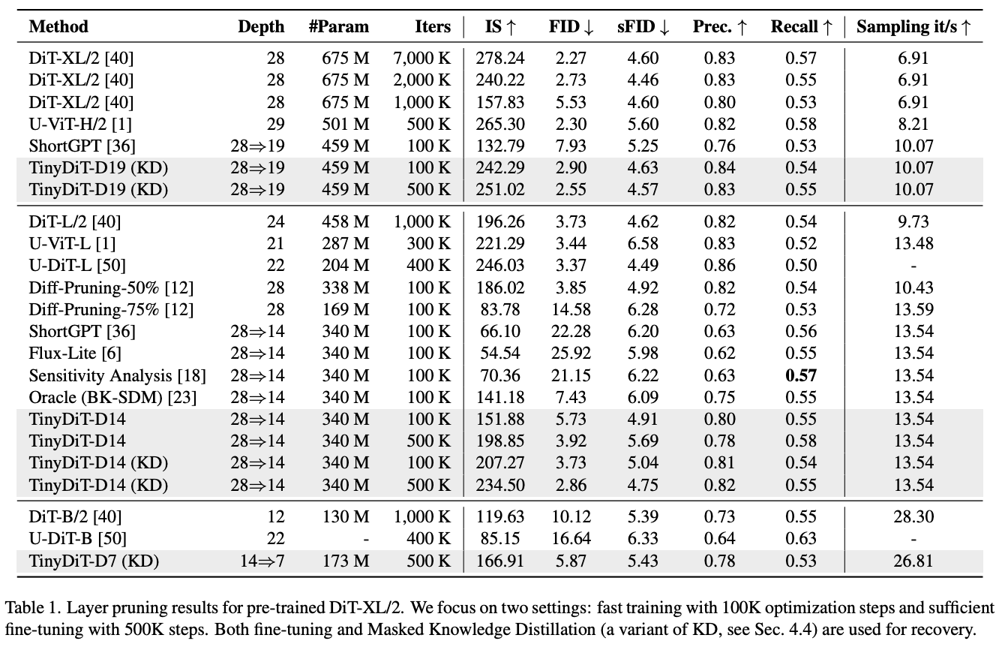
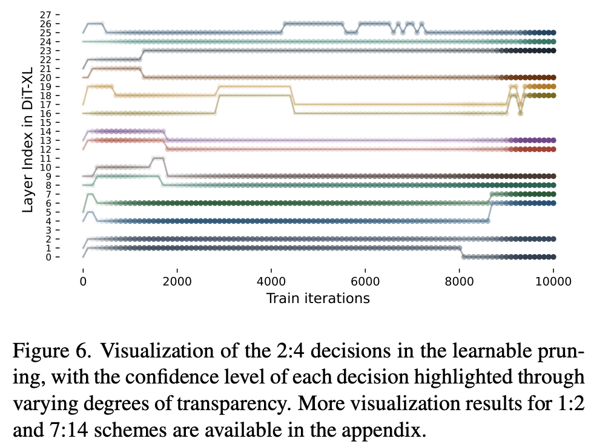

<div align="center">

<h1> TinyFusion </h1>

<div align="center">
 
  <em>
      Images generated by TinyDiT-D14 on ImageNet, pruned and distilled from a DiT-XL/2. It achieves a 2x speedup  using less than 7% of the original pre-training cost.
  </em>
</div>

<h3>TinyFusion: Diffusion Transformers Learned Shallow</h3>


[Gongfan Fang](https://fangggf.github.io/)†, [Kunjun Li](https://kunjun-li.github.io/)†, [Xinyin Ma](https://horseee.github.io/), [Xinchao Wang](https://sites.google.com/site/sitexinchaowang/)  
 
[National University of Singapore](https://nus.edu.sg/) 

*†: Equal Contribution*

📄 [[Arxiv]](https://arxiv.org/abs/2412.01199)
</div>

## 0. Learn a Shallow Diffusion Transformers

This work presents TinyFusion, a learnable **depth pruning** method for diffusion transformers. We highlight the following key findings:

* 💡 **Is calibration loss a reliable indicator?** Our experiments show that, pruned models with low calibration loss may not guarantee good post-finetuning performance.
* 🔑 **Optimizing the recoverability:** TinyFusion directly optimizes the recoverability of the pruned model, which ensures better performance after fine-tuning.
* ⚡ **Training Efficiency:** The trainable parameters in TinyFusion is only **~0.9%** of the original model, making the training process highly efficient.
* 📚 **Masked KD for Enchanced Recovery:**  A specialized Masked Knowledge Distillation excludes extreme activations in DiTs during knowledge transfer, significantly improving performance compared to standard fine-tuning.


<div align="center">
 
</div>


## 1. Preparation

### Extract ImageNet Features to enable fast training
```bash
torchrun --nnodes=1 --nproc_per_node=1 extract_features.py --model DiT-XL/2 --data-path data/imagenet/train --features-path data/imagenet_encoded
```

All scripts end with `_fast` require the pre-extracted features.

### Download Pre-trained DiT-XL/2

```bash
mkdir -p pretrained && cd pretrained
wget https://dl.fbaipublicfiles.com/DiT/models/DiT-XL-2-256x256.pt
```

## 2. Layer Pruning

### Learnable Pruning (Ours)

The script prune_by_learning.py allows users to prune and derive shallow versions of specific models. To learn a shallow DiT with 14 layers, we use the following script:

```bash
torchrun --nnodes=1 --nproc_per_node=8 prune_by_learning.py \
  --model DiT-XL-1-2 \
  --load-weight pretrained/DiT-XL-2-256x256.pt \
  --data-path data/imagenet_encoded \
  --epochs 1 \
  --global-batch-size 128 \
  --delta-w \
  --lora \
  --save-model outputs/pruned/DiT-D14-Learned.pt
```

#### Command Arguments

- `--model`: Specifies the model to be pruned. DiT-XL-1-2 will learn a 14 layer model with the block size of 2, where one layer will be removed from each block.

- `--data-path`: Path to the encoded ImageNet.  

- `--delta-w`: Allow weight udpates during decision optimization.

- `--lora`: Uses LoRA (Low-Rank Adaptation) for weight updates. If not specified, full fine-tuning will be used.

- `--save-model`: Path to save the pruned model.

#### Available Models

The script supports multiple models, each designed for specific pruning strategies. Below are the available options:

```bash
  DiT_XL_1_2,  # A model with 14 layers divided into blocks of size 2.
  DiT_XL_2_4,  # A model with 14 layers retaining 4 layers from each block of size 2.
  DiT_XL_7_14, # A deeper model with 7 layers derived from blocks of size 14.
  DiT_XL_1_4,  # A 7-layer model with blocks of size 4.
  DiT_D14_1_2, # Derived from TinyDiT-D14, pruning 1 out of 2 layers per block.
  DiT_D14_2_4  # Derived from TinyDiT-D14, retaining 2 layers out of 4 in each block.
```
To change the model, replace DiT_XL_1_2 in the command above with any of the options listed here.


### Pruning by BI Score (ShortGPT)

This script estimates the input and output similarity of each layer as the importance score. Please refer to [ShortGPT](https://arxiv.org/abs/2403.03853) for more details.

```bash
python prune_by_score.py --model DiT-XL/2 --ckpt pretrained/DiT-XL-2-256x256.pt --save-model outputs/pruned/DiT-D14-Score.pt --n-pruned 14
```

### Pruning with BK-SDM (Oracle) Scheme

BK-SDM keeps the first layers in each "encoder block" and the last layer in each "decoder block". For DiT, we treat the first 14 layers as the encoder and the last 14 layers as the decoder, and group every 2 layers as a block. The oracle pruning can be performed with:
```bash
python prune_by_index.py --model DiT-XL/2 --ckpt pretrained/DiT-XL-2-256x256.pt --kept-indices "[0, 2, 4, 6, 8, 10, 12, 14, 17, 19, 21, 23, 25, 27]" --save-model outputs/pruned/DiT-D14-Oracle.pt
```

### Pruning by Indices
To prune a model with predefined indices, use the following command:
```bash
python prune_by_index.py --model DiT-XL/2 --ckpt pretrained/DiT-XL-2-256x256.pt --save-model outputs/pruned/DiT-D14-by-Score.pt --kept-indices "[0, 1, 2, 3, 4, 5, 6, 7, 8, 9, 10, 11, 12, 13]"
```

## 3. Fine-tuning

### Standard Finetuning
```bash
torchrun --nnodes=1 --nproc_per_node=8 train_fast.py --model DiT-D14/2 --load-weight outputs/pruned/DiT-D14-Learned.pt --data-path data/imagenet_encoded --epochs 100 --prefix D14-Learned-Finetuning 
```

### Masked KD
Finetuning with the proposed Masked KD, which masks massive activations in the teacher's and student's hidden states. Please see the paper for more details.
```bash
# Masked KD
torchrun --nnodes=1 --nproc_per_node=8 train_masked_kd.py --model DiT-D14/2 --load-weight outputs/pruned/DiT-D14-Learned.pt --data-path data/imagenet_encoded --epochs 100 --prefix D14-Learned-RepKD --teacher DiT-XL/2 --load-teacher pretrained/DiT-XL-2-256x256.pt
```

## 4. Sampling for Evaluation

### DDP Sampling
```bash
torchrun --nnodes=1 --nproc_per_node=8 sample_ddp.py --model DiT-D14/2 --ckpt outputs/D14-Learned-Finetuning/checkpoints/0500000.pt
```

### FID (Requires Tensorflow 2.0)

Please refer to [https://github.com/openai/guided-diffusion/tree/main/evaluations](https://github.com/openai/guided-diffusion/tree/main/evaluations) for the ``VIRTUAL_imagenet256_labeled.npz``.
```bash
python evaluator.py data/VIRTUAL_imagenet256_labeled.npz PATH_TO_YOUR.npz
```

## 5. Key Results

<div align="center">
 
 <br>
</div>

<div align="center">
 
 <br>
</div>

## 6. BibTeX
  
```bibtex
```
