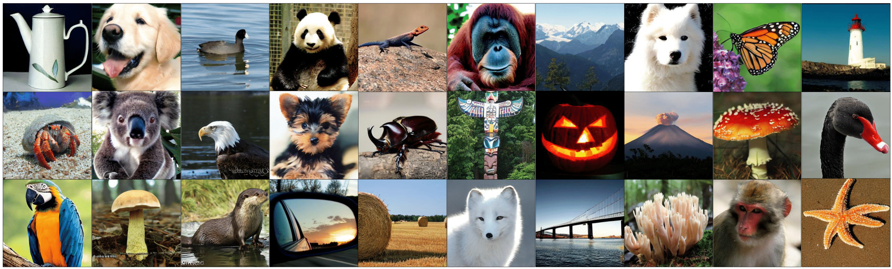
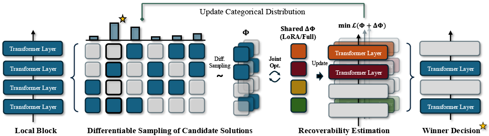
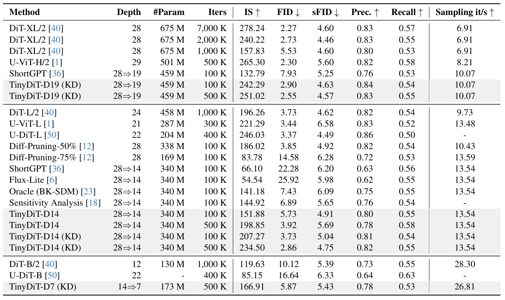
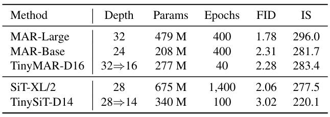

<div align="center">

<h1> TinyFusion </h1>

<div align="center">
 
  <em>
      Images generated by TinyDiT-D14 on ImageNet, pruned and distilled from a DiT-XL/2. It achieves a 2x speedup  using less than 7% of the original pre-training cost.
  </em>
</div>

<h3>TinyFusion: Diffusion Transformers Learned Shallow</h3>


[Gongfan Fang](https://fangggf.github.io/), [Kunjun Li](https://kunjun-li.github.io/), [Xinyin Ma](https://horseee.github.io/), [Xinchao Wang](https://sites.google.com/site/sitexinchaowang/)  
 
[National University of Singapore](https://nus.edu.sg/) 

</div>

## What is TinyFusion

This work presents TinyFusion, a learnable depth pruning method for diffusion transformers, designed to optimize recoverability through a joint learning process of pruning decisions and weight updates. By focusing on creating shallow, efficient models, TinyFusion significantly reduces computational costs while maintaining strong performance across various architectures.

<div align="center">
 
</div>


## Preparation

### Extract ImageNet Features to enable fast training
```bash
torchrun --nnodes=1 --nproc_per_node=1 extract_features.py --model DiT-XL/2 --data-path data/imagenet/train --features-path data/imagenet_encoded
```

All scripts end with `_fast` require the pre-extracted features.

### Download Pre-trained DiT-XL/2

```bash
mkdir -p pretrained
wget https://dl.fbaipublicfiles.com/DiT/models/DiT-XL-2-256x256.pt
```

## Layer Pruning

### Learnable Pruning (Ours)

The script prune_by_learning.py allows users to prune and derive shallow versions of specific models. The following command provides an e

```bash
torchrun --nnodes=1 --nproc_per_node=8 prune_by_learning.py \
    --model DiT_XL_1_2 \
    --load-weight pretrained/DiT-XL-2-256x256.pt \
    --data-path data/imagenet_encoded \
    --epochs 1 \
    --prefix learn_mask \
    --global-batch-size 128 \
    --delta-w \
    --lora
```
#### Command Arguments

- `--model`: Specifies the model to be pruned. Replace `DiT_XL_1_2` with your desired model configuration (see the Available Models section below).

- `--data-path`: Path to the encoded ImageNet.  

- `--delta-w`: Allow weight udpates during decision optimization.

- `--lora`: Uses LoRA (Low-Rank Adaptation) for weight updates. If not specified, full fine-tuning will be used.

#### Available Models

The script supports multiple models, each designed for specific pruning strategies. Below are the available options:

```bash
  DiT_XL_1_2,  # A model with 14 layers divided into blocks of size 2.
  DiT_XL_2_4,  # A model with 14 layers retaining 4 layers from each block of size 2.
  DiT_XL_7_14, # A deeper model with 7 layers derived from blocks of size 14.
  DiT_XL_1_4,  # A 7-layer model with blocks of size 4.
  DiT_D14_1_2, # Derived from TinyDiT-D14, pruning 1 out of 2 layers per block.
  DiT_D14_2_4  # Derived from TinyDiT-D14, retaining 2 layers out of 4 in each block.
```
To change the model, replace DiT_XL_1_2 in the command above with any of the options listed here.


### Pruning by Score
```bash
python prune_by_score.py --model DiT-XL/2 --ckpt pretrained/DiT-XL-2-256x256.pt --save-model outputs/pruned/DiT-D14-by-Score.pt --n-pruned 14
```

### Pruning with BK-SDM (Oracle) Scheme
```bash
python prune_by_index.py --model DiT-XL/2 --ckpt pretrained/DiT-XL-2-256x256.pt --kept-indices "[0, 2, 4, 6, 8, 10, 12, 14, 17,
 19, 21, 23, 25, 27]" --save-model outputs/pruned/DiT-D14-Uniform.pt
```

### Pruning by Indices
```bash
python prune_by_index.py --model DiT-XL/2 --ckpt pretrained/DiT-XL-2-256x256.pt --save-model outputs/pruned/DiT-D14-by-Score.pt --kept-indices "[0,2,4,6,8,10]"
```


## Training

```bash
# Regular Finetune
torchrun --nnodes=1 --nproc_per_node=8 train_fast.py --model DiT-D14/2 --load-weight outputs/pruned/DiT-XL-D14-Learned.pt --data-path data/imagenet_encoded --epochs 100 --prefix D14-Learned-Finetuning 

# Masked KD
torchrun --nnodes=1 --nproc_per_node=8 train_masked_kd.py --model DiT-D14/2 --load-weight outputs/pruned/DiT-XL-D14-Learned.pt --data-path data/imagenet_encoded --epochs 100 --prefix D14-Learned-RepKD --teacher DiT-XL/2 --load-teacher pretrained/DiT-XL-2-256x256.pt
```

## Sampling

```bash
torchrun --nnodes=1 --nproc_per_node=8 sample_ddp.py --model DiT-D14/2 --ckpt outputs/D14-Learned-Finetuning/checkpoints/0500000.pt
```

## FID (Requires Tensorflow 2.0)

Please refer to [https://github.com/openai/guided-diffusion/tree/main/evaluations](https://github.com/openai/guided-diffusion/tree/main/evaluations) for the ``VIRTUAL_imagenet256_labeled.npz``.
```bash
python evaluator.py data/VIRTUAL_imagenet256_labeled.npz PATH_TO_YOUR.npz
```

## Key Results

<div align="center">
 
 <br>
 <em>
 Layer pruning results for pre-trained DiT-XL/2. We focus on two settings: fast training with 100K optimization steps and sufficient fine-tuning with 500K steps. Both fine-tuning and Masked Knowledge Distillation are used for recovery.
 </em>
</div>

<div align="center">
 
 <br>
 <em>
 Depth pruning results on Masked Autoregressive models (MARs) and Scalable Interpolant Transformers (SiTs).
 </em>
</div>
